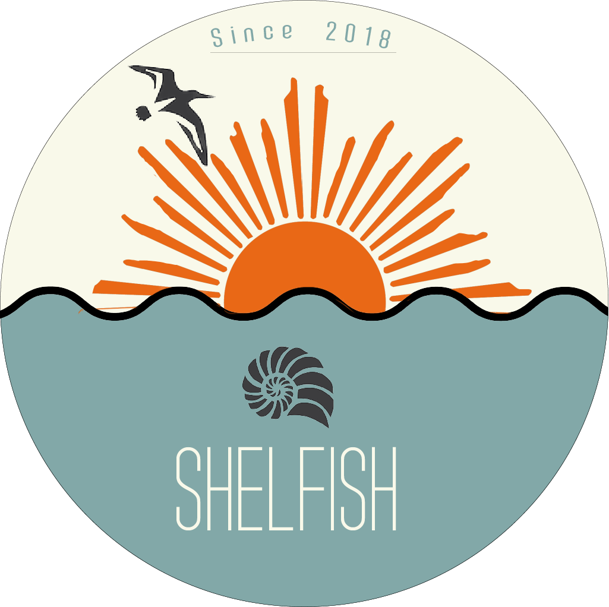

# Shelfish: The Library Management System

 

For our project, we decided to use:
 * Java
 * Maven
 * Spring Framework
 	* _introduces MVC project structure which is easy to understand, as well as brings great capabilities to the project._
 * MySQL
 	* _for the database_
 * Hibernate
 	* _for managing database from inside the program_
 * HTML
 * GitHub

Our application is a web application. Our idea is that the system is going to be used by both users and librarians. A user goes to the website, searches for a document he wants, then books it. After that, he physically goes to the library, says that he has a booking, librarian then hands out the document to a user and changes the order status to “taken”. During the 2/3/4 weeks from taking the document, user can watch the time remaining on the website. If user brings the document back before the time has expired, he is free to go (and librarian deletes the order) or he can renew the document (and librarian changes order status to “renewed”); if his document is overdue, he is forced to pay a fine.

# How to install a project
 - Install MySql (help here https://dev.mysql.com/doc/workbench/en/wb-mac.html) and run the server.
 - Install any Spring-compatible Java IDE (we suggest JetBrains IntelliJ IDEA, which will be used in this guide (https://www.jetbrains.com/idea/download))
 - Intall Lombok plugin and Spring Framework (no need if IDEA Ultimate is used) from the JetBrains repositories
 - Download the project itself (https://github.com/FalafelTeam/Shelfish)
 - Import the project into the IDE with Maven import (point to the pom.xml file in the project if asked to)
 - launch main/java/com.FalafelTeam.Shelfish/ShelfishApplication.java
 
 _**Note:** Easier process of installation is being worked on._
 
# How to add a new type of user
